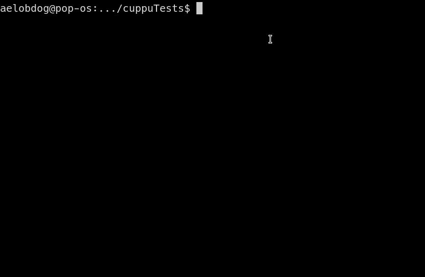

# Cuppu

## What is Cuppu ?
Cuppu86 is an 8086 emulator backend written in C89.

## About
This project was started in order to learn more about how a simple processor like the 8086 works. The project is designed to work as a "library" in the sense that it provides all the back-end functionality of a "cpu". Third party clients can be designed to work with this code by downloading the files in this repo and then "including" the [cpu.h] header file, and then compiling all the c files provided alongside their code.

The emulator supports 98% of the opcode set. Instructions involving interrupts are left unimplemented.

## Demo
Using a highly highly experimental client that [samarthkm](https://github.com/samarthkm) wrote and I modified, here's a demo of the emulator calculating the factorial of the number 5.

(here register `ax` is calculating the factorial. 0x78 is 120 in decimal (5!))

## License
    Copyright (C) 2021 Ashwin Godbole
 
    Cuppu86 is free software: you can redistribute it and/or modify it under the
    terms of the GNU General Public License as published by the Free Software
    Foundation, either version 3 of the License, or (at your option) any later
    version.

    Cuppu86 is distributed in the hope that it will be useful, but WITHOUT ANY 
    WARRANTY; without even the implied warranty of MERCHANTABILITY or FITNESS
    FOR A PARTICULAR PURPOSE. See the GNU General Public License for more
    details.

    You should have received a copy of the GNU General Public License along
    with Cuppu86. If not, see <https://www.gnu.org/licenses/>.
